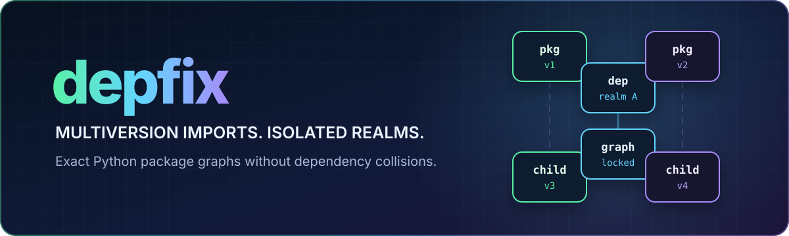

<p align="center">
  
</p>

<h3 align="center">Python dependencies solved. Use one package in multiple versions simultaneously. Install at runtime.</h3>

<p align="center">
  Depfix lets one Python process load multiple pure-Python package versions side by side—even when their transitive dependencies conflict.
</p>

<p align="center">
  <a href="https://pypi.org/project/depfix/"></a>
  <a href="https://pypi.org/project/depfix/"></a>
  <a href="https://github.com/agent0ai/depfix/actions/workflows/ci.yml"></a>
  <a href="https://github.com/sponsors/agent0ai"></a>
</p>

<p align="center">
  <a href="#quick-start">Quick start</a> ·
  <a href="#why-depfix">Why Depfix</a> ·
  <a href="#from-live-imports-to-locked-deployments">Deployment</a> ·
  <a href="#documentation">Documentation</a> ·
  <a href="https://github.com/agent0ai/depfix/issues">Issues</a>
</p>

```python
import depfix

with depfix.using("idna==2.10"):
    import idna as idna_2

with depfix.using("idna==3.10"):
    import idna as idna_3

assert idna_2 is not idna_3
```

No virtual-environment switching. No `sys.path` swapping. No installation into the active `site-packages`.

## Why Depfix

| Capability | Why it matters |
| --- | --- |
| **Side-by-side versions** | Load different versions of the same pure-Python distribution in one process. |
| **Dependency realms** | Each root keeps parent-specific dependency edges, so one graph does not flatten into another. |
| **Standard Python imports** | Select persistent defaults or temporary scopes, then use ordinary `import` statements. |
| **Reproducible deployments** | Export deterministic manifests, install frozen state, and build complete air-gap bundles. |
| **Real package sources** | Resolve PyPI requirements, Git refs, URLs, local projects, wheels, and standalone Python files. |
| **Honest isolation** | Pure-Python realm loading is supported; unsafe native-extension loading fails explicitly. |

See the runnable [AWS CLI and Boto3 dependency-conflict example](https://github.com/agent0ai/depfix/tree/main/examples/conflicting_botocore_versions)
for two incompatible Botocore graphs operating in one Python process.

## Quick start

Install Depfix from PyPI:

```bash
python -m pip install depfix
```

Select persistent versions, then import normally:

```python
import depfix

depfix.default(
    "requests>=2.31,<3",
    "PyYAML==6.0.2",
)

import requests
import yaml
```

Use separate temporary scopes when code needs incompatible versions:

```python
import depfix

with depfix.using("requests==2.31.0"):
    import requests as requests_old

with depfix.using("requests==2.32.3"):
    import requests as requests_new
```

`default()` creates an additive persistent import map. `using()` temporarily overrides matching defaults, supports nested
contexts, and also decorates synchronous or asynchronous functions. Imported objects retain their dependency realm after
the scope exits. For explicit dynamic loading, use `depfix.import_module(...)`; use `depfix.load_package(...)` to inspect a
distribution exposing several roots.

Importing `depfix` itself does not patch imports or perform resolution, network, cache, or subprocess work. The lightweight
dispatcher is installed by the first `default()` or `using()` call. Cold preparation reports resolution, uv summaries, downloads, and materialization
on stderr. Set `DEPFIX_LOG_LEVEL=WARNING` or call `configure(log_level="WARNING")` to silence progress.

## How it works

```text
requirement or source
  → exact uv-backed resolution
  → hash-pinned artifact graph
  → verified, content-addressed cache
  → parent-specific dependency realm
  → canonical synthetic module identity
```

Realm modules live under graph- and node-qualified internal names. Their logical imports are resolved through declared
dependency edges, not the process's ambient third-party packages. Repeated calls for the same graph and logical module
return the same module object.

Depfix invokes uv through its documented executable interface. It does not import uv internals, vendor a uv binary, alter
the active environment, or add prepared package trees to global `sys.path`.

## Sources

```python
from depfix import import_module

import_module("requests>=2.31,<3")
import_module("pypi:requests[socks]~=2.32")
import_module("git:https://github.com/acme/sdk.git@v2.4.0")
import_module("url:https://packages.example/acme_sdk-2.4.0-py3-none-any.whl#sha256=<digest>")
import_module("file:../acme-sdk")
import_module("file:./helpers.py")
import_module("py:https://modules.example/utilities.py#sha256=<digest>")
```

Standard PEP 508 direct references work too. Mutable Git refs are pinned to commits during export. Credentials remain in
external uv, index, keyring, or Git configuration and are never serialized into manifests.

## From live imports to locked deployments

Live mode is ideal for exploration: it resolves into the platform cache and creates no project files. When the graph must
be reproducible, prepare it explicitly:

```bash
depfix export . --output .depfix/imports.lock
depfix install .depfix/imports.lock --frozen
DEPFIX_FROZEN=1 python application.py
```

`export` scans static `default()`, `using()`, `import_module()`, and `load_package()` declarations without executing
application code. It preserves each multi-package standard-import declaration as one consistent realm request and records
exact artifacts, hashes, target identity, import ownership, source provenance, policy, and parent-specific edges.

For disconnected targets:

```bash
depfix bundle .depfix/imports.lock --output dist/application.depfixbundle --include-depfix-runtime
depfix install dist/application.depfixbundle --offline --frozen
```

| Mode | Resolution | Network | Project state |
| --- | --- | --- | --- |
| **Live** | On the first request | Allowed by policy | None |
| **Prepared** | During export | Optional during install | Deterministic manifest |
| **Air-gapped** | On the connected build host | Forbidden on target | Manifest + exact bundle |

## IDE support

```bash
depfix ide sync .depfix/imports.lock
depfix ide configure .depfix/imports.lock
```

Depfix generates a physical `depfix_imports` package with graph-specific stubs, editor snippets, source maps, and an
optional default-import type overlay. Scanner-derived aliases keep scoped versions distinct. Generic IDEs cannot infer
arbitrary context-sensitive imports, so use generated aliases when exact scoped completion matters:

```python
from depfix_imports import requests_old, requests_new
```

## Boundaries worth knowing

Depfix is an alpha release focused on CPython 3.11–3.13. Its isolation boundary prevents dependency-graph collisions; it
is not a sandbox for untrusted Python code.

Pure-Python wheels, namespace packages, resources, relative and circular imports, selected metadata access, threads, and
spawn workers are covered. Native extensions can carry process-global ABI and library state that cannot be made safe by
renaming a module. Depfix rejects unknown native loading with `NativeIsolationRequired`; use an application-owned worker
process when native code is required.

## Documentation

| I want to… | Start here |
| --- | --- |
| Get a project running | [Getting started](https://github.com/agent0ai/depfix/blob/main/docs/guides/getting-started.md) |
| Understand dependency isolation | [Import realms](https://github.com/agent0ai/depfix/tree/main/docs/concepts/import-realms) |
| Follow resolution and package discovery | [Resolution](https://github.com/agent0ai/depfix/tree/main/docs/concepts/resolution) |
| Prepare containers or offline systems | [Deployment](https://github.com/agent0ai/depfix/tree/main/docs/concepts/deployment) |
| Inspect the Python surface | [Python API](https://github.com/agent0ai/depfix/blob/main/docs/reference/api.md) |
| Inspect every command | [CLI reference](https://github.com/agent0ai/depfix/blob/main/docs/reference/cli.md) |
| Review security assumptions | [Threat model](https://github.com/agent0ai/depfix/blob/main/docs/operations/threat-model.md) |
| Diagnose a failure | [Troubleshooting](https://github.com/agent0ai/depfix/blob/main/docs/guides/troubleshooting.md) |

Browse the complete [documentation map](https://github.com/agent0ai/depfix/tree/main/docs).

## Created by Agent Zero

Depfix is an open-source project by [agent0ai](https://github.com/agent0ai), creator of
[Agent Zero](https://github.com/agent0ai/agent-zero), [Space Agent](https://github.com/agent0ai/space-agent), and
[DOX](https://github.com/agent0ai/dox).

- Found a bug or compatibility gap? [Open an issue](https://github.com/agent0ai/depfix/issues).
- Want to contribute? Read [CONTRIBUTING.md](https://github.com/agent0ai/depfix/blob/main/CONTRIBUTING.md).
- Preparing a release? Follow [RELEASING.md](https://github.com/agent0ai/depfix/blob/main/RELEASING.md).
- Want to support agent0ai's work? [Sponsor on GitHub](https://github.com/sponsors/agent0ai).

## License

Depfix is released under the [MIT License](https://github.com/agent0ai/depfix/blob/main/LICENSE).
